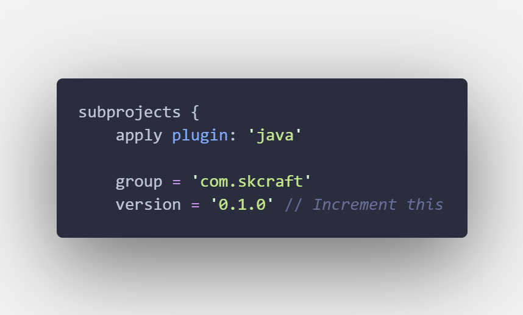

<div style="text-align: center;">

# This website hosts the AMcD Modpack Launcher.

<span style="display: inline; font-size: 20px;">Download the launcher here:</span>
<button onclick="window.location.href='./AMcD-Launcher.exe'" style="display: inline; margin-left: 20px; padding: 10px 20px; background-color: #238636; color: white; border: none; border-radius: 6px; cursor: pointer; font-weight: 600;">Download for Windows</button>

</div>

<br/>

# Launcher/Modpack Editing Instructions

I have tried to explain everything as best as I can, but **always consult [the official SKCraft Launcher Wiki](https://github.com/SKCraft/Launcher/wiki) for reference.**

## Setup

Clone the launcher repository:

```
git clone https://github.com/AdvancedMCDevices/AMcD-Launcher.git
```

Clone the modpacks repository:

```
git clone https://github.com/AdvancedMCDevices/Modpacks.git
```

Clone the website repository:

```
git clone https://github.com/AdvancedMCDevices/AdvancedMCDevices.github.io.git
```

The launcher is comprised of multiple folders/files, but only a few are necessary to make edits:

```
|- creator-tools/          <- Tools to help create modpacks
|- launcher/               <- The launcher source code
|- launcher-fancy/         <- Files for the fancy launcher UI
|- build.bat               <- Build script for Windows
|- build.gradle            <- Gradle build configuration
|- build.sh                <- Build script for Mac/Linux
```

## Making Changes

### Creating/Editing a Modpack

Open the `creator-tools` folder, navigate to `/build/libs/creator-tools-2.1.0-SNAPSHOT.jar`, and run it with Java 8.

Open the modpack repository folder in the tool.

From here, you can create a new modpack or edit an existing one, dropping loaders, mods, configs, resource packs, etc. into the appropriate folders. **Follow the SKCraft Launcher Wiki guidelines for modpack structure.**

After making changes, save the modpack and run the build script to generate the necessary files for the launcher - these will appear in the `_uploads` folder in the modpack repository.

### Editing the Launcher

For edits to the initial launcher UI (the first screen you see), navigate to `/launcher-fancy/src/main/resources/com/skcraft/launcher`. Here, you can edit primarily the background image and color elements.

For deeper edits to the launcher functionality or appearance, navigate to `/launcher/src/main/resources/com/skcraft/launcher`. Here, you can edit the launcher's properties, icon files, etc. These edits can effect both the launcher's appearence and its functionality, including where it pulls modpacks from.

## Publishing Changes

After making changes to a modpack, replace the contents of the `modpacks` folder in the website repository with the contents of the `_uploads` folder and push the changes to GitHub.

After making changes to the modpack or launcher, but before building the new changes, open build.gradle and increment the version - either the second decimal for major changes or third decimal for minor changes. **The new version must be higher than the previous version** Remember that, for example, 1.10.0 is higher than 1.9.0.



Then, run the appropriate build script (`build.bat` for Windows or `build.sh` for Mac/Linux) in the root of the launcher repository. This will compile the launcher with your changes. **You must do this for both modpack and launcher changes - the launcher only pulls the new modpack at build time.** This should be done AFTER pushing any modpack changes to the website repository.

After building, navigate to the `launcher-fancy/build/libs` folder and find the newly created `launcher-fancy-x.x.x.jar` file. Replace the JAR in the `launcher` folder of the website repository with this new JAR and update `latest.json` to include both the new version and the new URL to the launcher. Push the website changes to GitHub.
